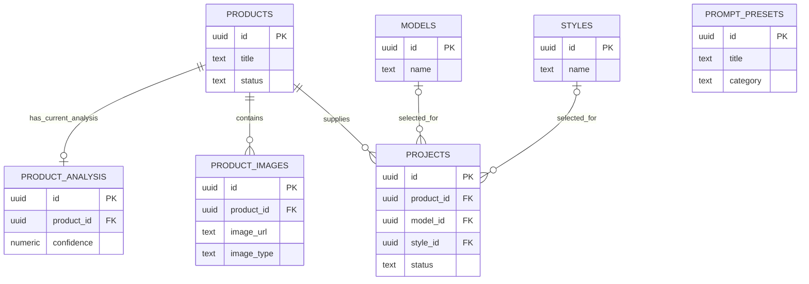

# Vann AI Studio V1 Entity Relationship Diagram

Status: proposed for architecture review. This diagram describes the planned data relationships only; it does not create a database schema.

## Relationship explanation

### `products` → `product_images`

**Cardinality:** one product to zero or many product images.

`product_images.product_id` references `products.id`. A product may be created before any asset is added; every stored image must belong to one product. This supports source photos, reference photos, and future generated variants without duplicating product information.

### `products` → `projects`

**Cardinality:** one product to zero or many projects.

`projects.product_id` references `products.id`. Multiple creative projects may be produced for the same affiliate product—for example, different models, styles, campaigns, or publishing variants. Each project must identify one product in V1.

### `products` → `product_analysis`

**Cardinality:** one product to zero or one current product analysis.

`product_analysis.product_id` references `products.id` and must be unique when implemented. A product can exist without AI analysis, but an analysis cannot exist without a product. A later analysis-history table can hold multiple immutable runs while this table continues to expose the current result.

### `models` → `projects`

**Cardinality:** one model to zero or many projects; a project to zero or one model.

`projects.model_id` references `models.id` and is nullable. Projects can begin before a model is selected, while a reusable model can support many projects. A future model-reference or pose table should handle multiple images and pose variations per model.

### `styles` → `projects`

**Cardinality:** one style to zero or many projects; a project to zero or one style.

`projects.style_id` references `styles.id` and is nullable. This keeps a project draftable before visual direction is finalized and allows consistent styles to be reused across projects.

### `prompt_presets`

`prompt_presets` is intentionally independent in V1. It is a reusable catalog, not an execution log. When the product needs traceability, a future prompt-run table can connect a project, a preset version, input context, provider, and generated result without changing the preset’s basic role.

## Integrity decisions for migration review

- Enforce the product-analysis one-to-one rule with a unique constraint on `product_analysis.product_id`.
- Require `projects.product_id` and `product_images.product_id`; allow `projects.model_id` and `projects.style_id` to be null while a project is a draft.
- Prefer archival states over cascading deletion of products, models, or styles with history.
- Add foreign-key indexes for join paths: `product_images.product_id`, `projects.product_id`, `projects.model_id`, `projects.style_id`, and `product_analysis.product_id`.
- Define status vocabularies and deletion policies during the migration-design review; neither belongs in this planning-only sprint.

## Extensibility map

| Future module | Recommended future parent | Reason |
| --- | --- | --- |
| Fashion Brain | `projects` and `prompt_presets` | Captures creative decisions and prompt execution in a specific workflow context. |
| Motion Studio | `projects` | Motion generations are outputs of a product-content project. |
| Publishing | `projects` | Platform exports, captions, schedules, and publish status belong to a project. |
| AI Analysis | `products` and future analysis-run history | Product facts originate with the product and should retain analysis provenance. |
| Video Generation | `projects` | Video jobs and generated media require project-level lifecycle and provenance. |
